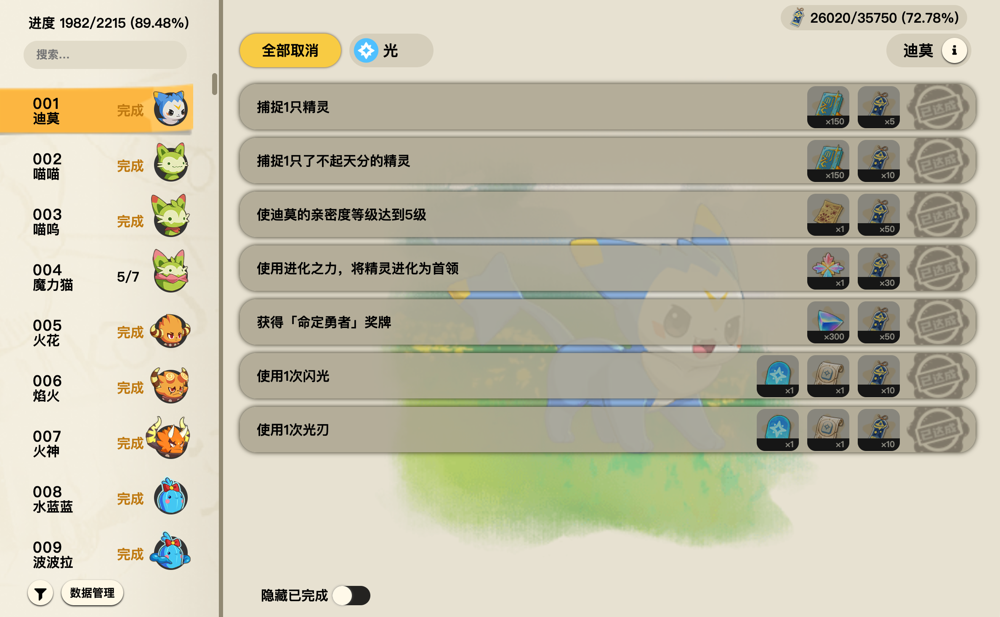
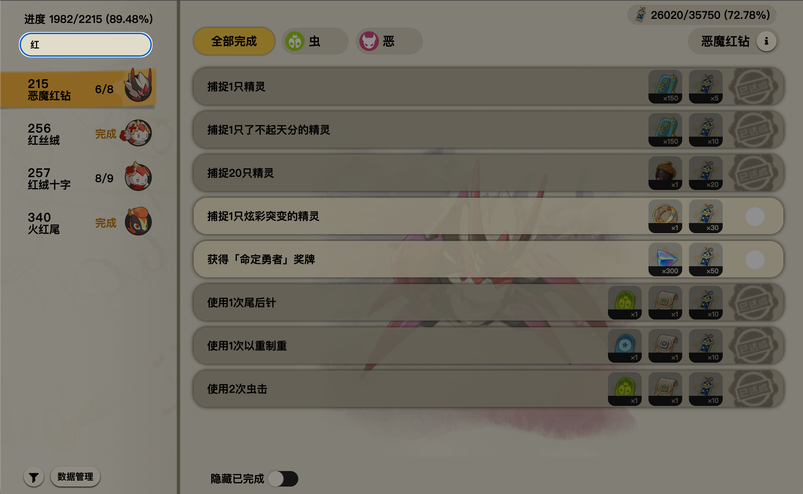
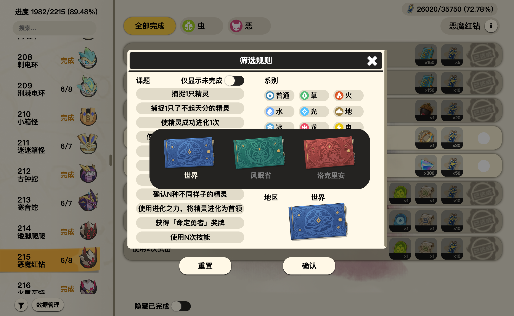
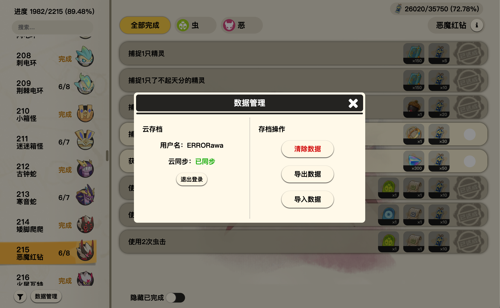
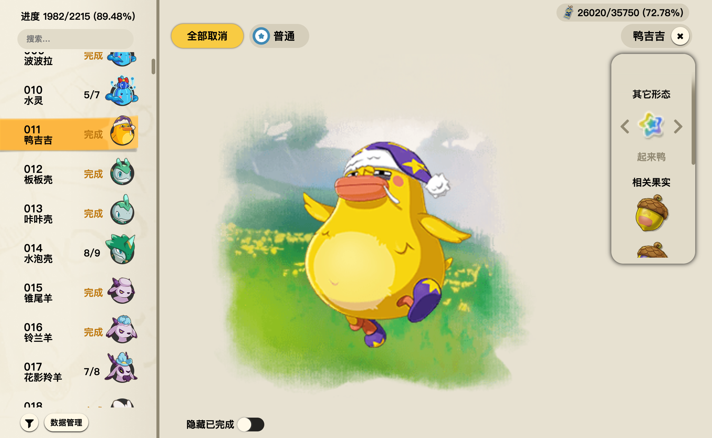
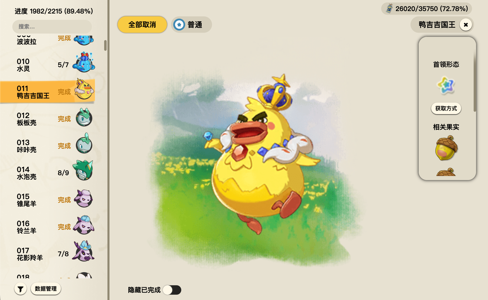
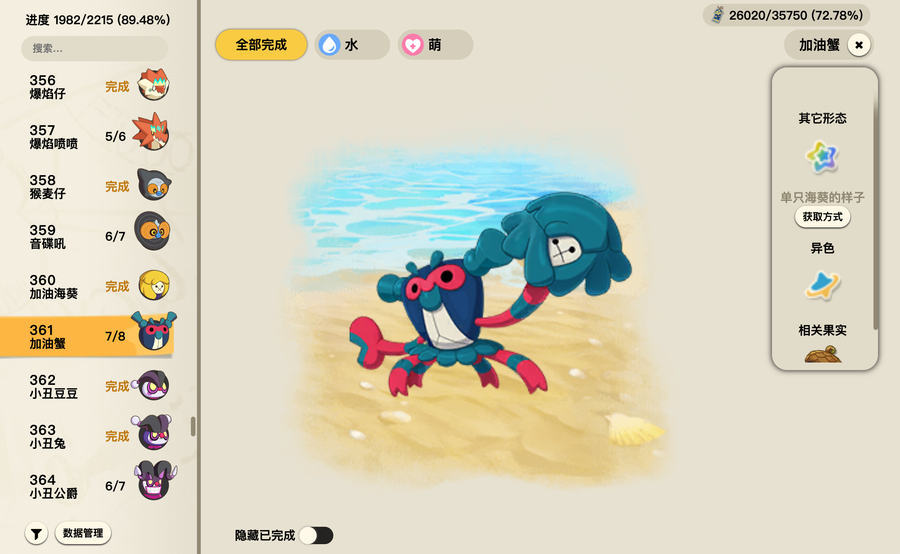
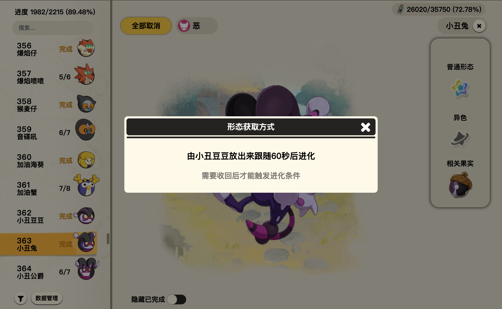
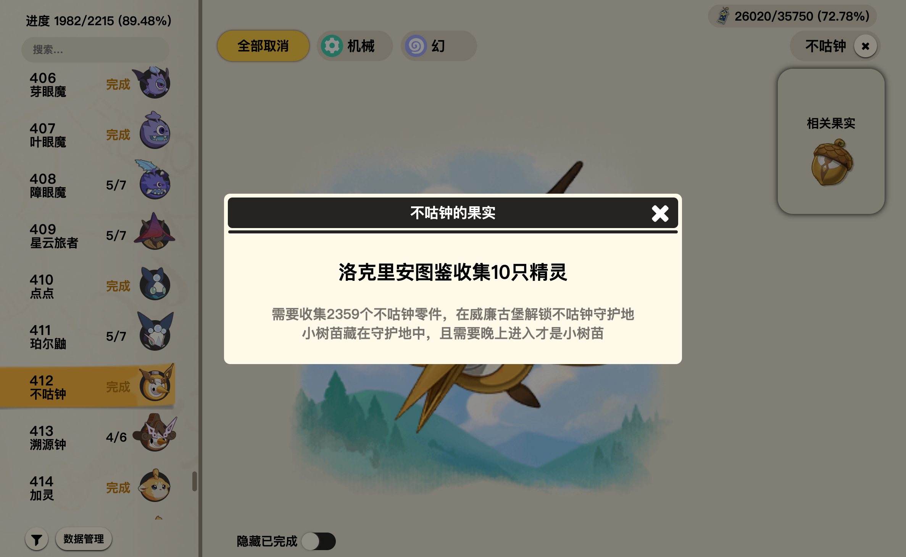
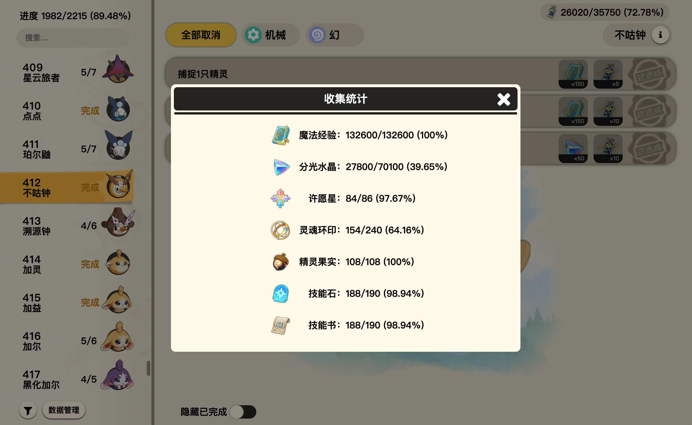

# 洛克图鉴
洛克王国：世界的外置课题图鉴

用于展示所有精灵的属性、各种形态、果实

也包括部分精灵的特殊获取、特殊进化条件等

当然还有最主要的功能，课题勾选完成进度

该项目使用 web worker 来实现离线使用功能，也就是说当网站完全加载完成之后，你可以在设备断网的情况下正常使用

## 主要功能

左侧精灵列表，显示编号、名字、头像、课题完成进度

右侧详细课题列表,显示课题、奖励内容、是否完成、系别、名字和更多信息

## 搜索

同时支持根据编号搜索、根据名称筛选

## 筛选

支持根据课题（并集）、系别（并集）、地区组合筛选

## 数据管理

支持云存档，该功能使用Gitee仓库实现

其中OAuth功能需要[自建后端API](https://github.com/ERRORawa/RocoOAuthAPI)使用，私人令牌功能可完全由前端进行

一切数据操作在前端直接进行，直接对Gitee进行操作，自动完成`创建rocoSave私人仓库，创建存档文件，进行存档上传和下载`

在勾选课题之后，会等待一段时间对云存档进行同步；在进入网页时，同样会对云存档进行检查

## 精灵详细信息

用于切换精灵不同形态、异色和查看果实样子、获取方式等

也同样可以查看形态获取、进化方式和果实的获取方式等

 
 

## 收集统计

点击右上角的“课题研究点统计”可查看所有奖励的收集情况

